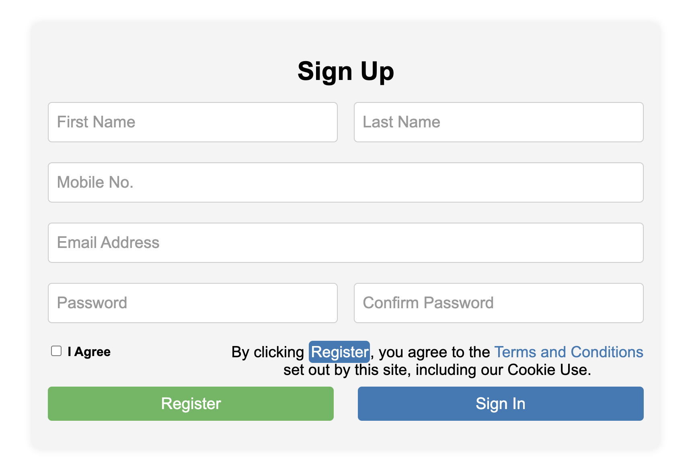

# Signup Form Project

## Description

This project demonstrates a simple, responsive signup form created using HTML and CSS. The form includes fields for first name, last name, mobile number, email address, password, and confirm password. Additionally, there is a checkbox for agreeing to terms and conditions and buttons for registering and signing in.

## Files

- `practice-day1.html`: The main HTML file containing the structure of the signup form.
- `practice-day1.css`: The CSS file that styles the signup form and makes it responsive.

## Final Output

