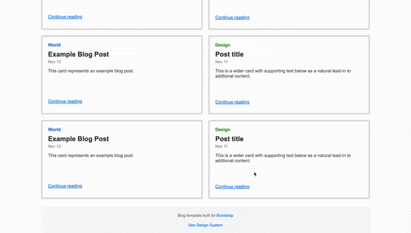

# Blog Template Project

This project is a simple blog template built with HTML and CSS, designed to showcase blog posts in a clean and responsive layout.

## File Structure

- `assets/search.svg`: An SVG file for the search icon used in the navigation bar.
- `index.html`: The main HTML file containing the structure of the blog.
- `styles.css`: The CSS file for styling the blog template.

## Project Overview

The blog template includes the following sections:

- **Navigation Bar**: Contains a subscribe link, the blog title, and a search icon.
- **Blog Cards**: Displays multiple blog post cards with categories, titles, dates, descriptions, and "Continue reading" links.
- **Footer**: Includes links to Bootstrap and the Design System.

## How to Use

1. Clone or download the project files.
2. Open `index.html` in your web browser to view the blog template.
3. Modify the HTML and CSS files as needed to customize the template for your own use.

## Video Demonstration

