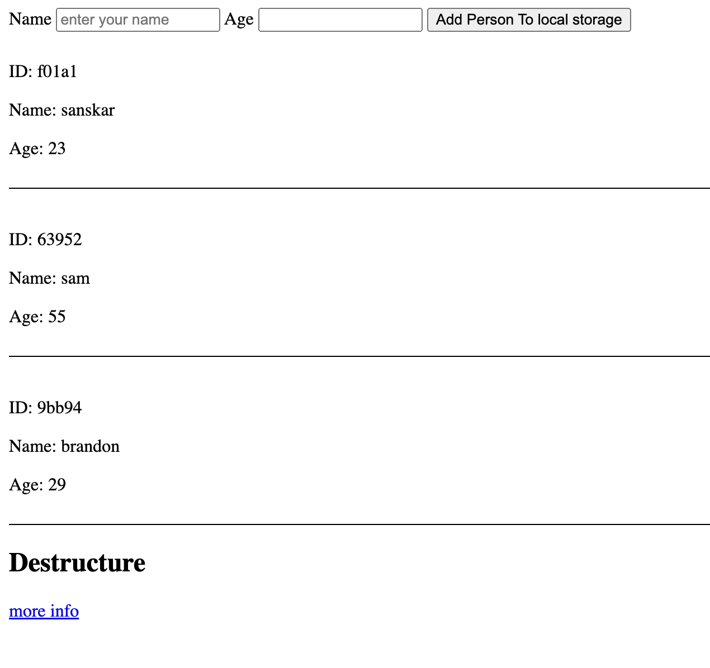

# Person Form Application

This is a simple web application that allows users to add person details (ID, Name, and Age) to a list and displays them on the page. The details are stored in the browser's localStorage.

## Features

- Add a new person's details (ID, Name, Age).
- Display the added person details on the DOM.
- Store the person details in the browser's localStorage.

## Requirements

- A modern web browser that supports JavaScript and localStorage.
- UUID library for generating unique IDs.

## Output Structure

